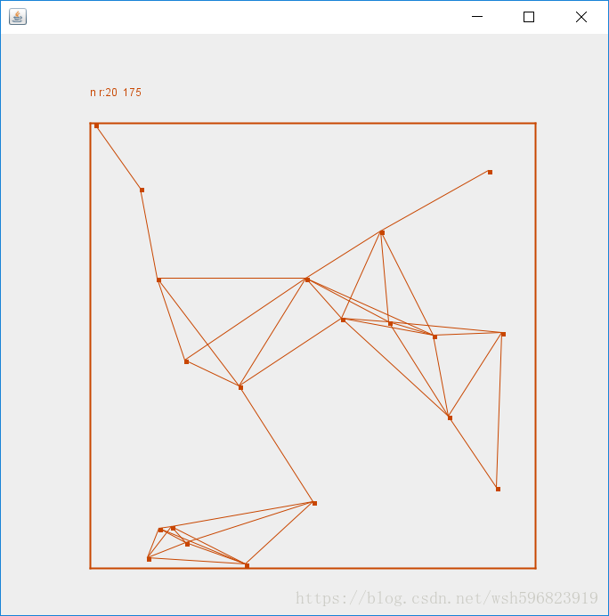
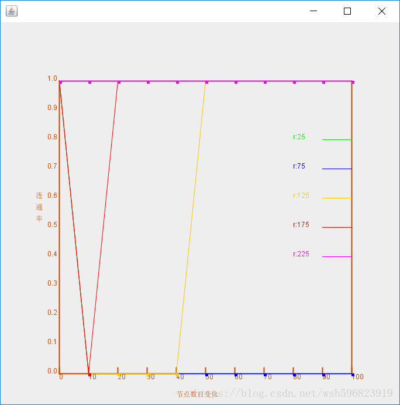
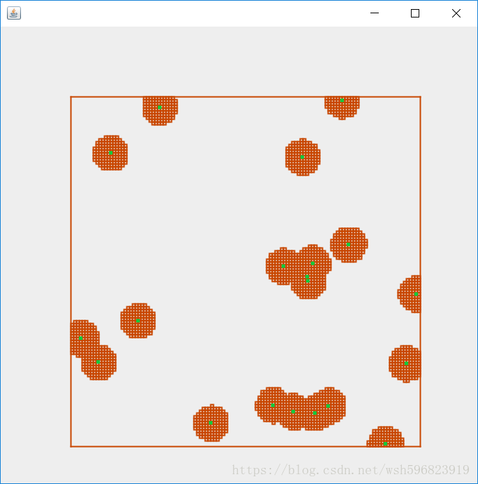
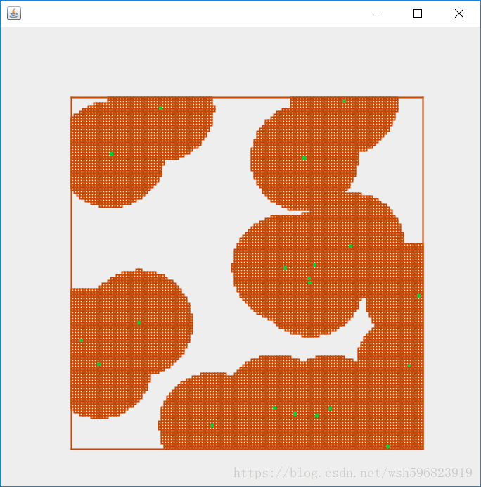
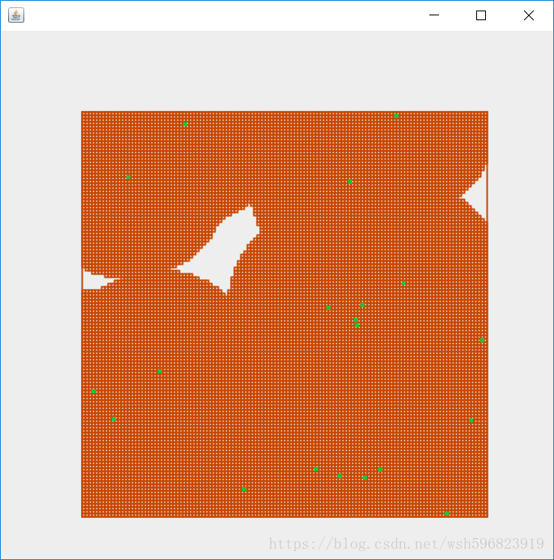
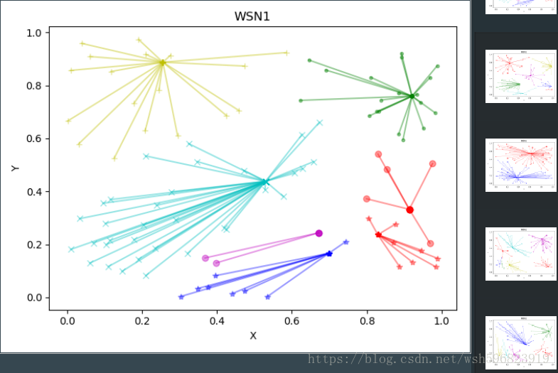

# Wireness Network

> WSN 无线传感网络模拟测试

---------------------------------------------------------------

# 目录

1. 实验一：[WSN连通性模拟](#实验一)
2. 实验二：[WSN覆盖率模拟](#实验二)
3. 实验三：[WSN分簇模拟](#实验三)
4. 实验四：[WSN能量损耗模拟](#实验四)

---------------------------------------------------------------

# 实验一
## 无线传感网络连通性测试

### 项目路径

src/main/java/com/ten/wsn/connection

### 描述

（1）在不同节点数目n情况下，拟合出连通率与通信半径的关系曲线 

（2）在不同通信半径R情况下，拟合出连通率与节点数量n的关系曲线

### 实验过程

**（1）在不同节点数目下，判断连通率与通信半径的关系：**

a. 在一个边长为1的正方形区域，随机撒N个节点，即通过rand函数随机生成节点X、Y轴坐标从而生成随机节点

b. 改变通信半径R，从0.01每次递增0.01直到达到1

c. 遍历生成的随机节点，根据sqrt函数求得两点间的距离r，判断r与R的大小关系；若r<R,则点联通；若r>R，则点不连通；

d. 根据随机节点的连通性判断来创建邻接矩阵p

e. 通过快速wars hell算法判断图连通性，求p,p^2,....直到p的n-1阶矩阵，将所有矩阵相加；若矩阵中存在0元素，则判断图不连通；反之，则判断图连通

f. 重复上述实验1000次，将图连通的次数与实验次数1000次相处，即得到了连通率

**（2）在不同通信半径下，判断连通率与节点数目的关系：**

a. 在边长为1的正方形区域内，给定通信半径R;

b. 改变节点数目N，从1每次递增1直到达到100;

c. 根据节点数目N，通过rand(n,2,1)创建随机节点，矩阵第一列为节点X轴坐标，矩阵第二列为节点Y轴坐标;

d. 遍历生成的随机节点，根据sqrt函数求得两点间的距离r，判断r与给定R的大小关系；若r<R,则点联通；若r>R，则点不连通；

e. 根据随机节点的连通性判断来创建邻接矩阵p

f. 通过快速wars hell算法判断图连通性，求p,p^2,....直到p的n-1阶矩阵，将所有矩阵相加；若矩阵中存在0元素，则判断图不连通；反之，则判断图连通

g. 重复上述实验1000次，将图连通的次数与实验次数1000次相处，即得到了连通率

### 实验结果

---------------------------------------------------------------

# 实验二
## 无线传感网络覆盖率测试

### 项目路径

src/main/java/com/ten/wsn/coverage

### 描述 

（1）给定传感器网络规模（即节点数目n）和能级，绘出网络的覆盖图；

（2）给定传感器网络规模（即节点数目n），拟合出网络覆盖率与能级之间的关系折线图。

### 实验过程

**（1）步骤描述**

A. 给定节点数目n = 100，通信半径R=0.1~0.3（R基于实验一的结果，100个随机节点，通信半径在0.1~0.3之间可实现连通）

B. 在一个边长为1的正方形区域，随机撒100个节点，即通过rand函数随机生成节点X、Y轴坐标从而生成随机节点；

C. 判断随机网络是否连通，如连通执行下步，否则返回A

D. 将边长为1的正方形区域，划分成100*100网格，将网格的交点作为实验对象点；

E. 在网格中，从上到下，从左到右遍历各交点，，根据sqrt函数求得每一个交点到100个随机节点的距离r,判断r与R的大小关系；若r<R,则此交点被覆盖；若r>R，则交点不被覆盖；

F. 将被覆盖的交点个数N / 总交点数100*100，即为所要求得传感器网络的覆盖率；

G. 多次改变所给定的通信半径R的值，求得其覆盖率；

### 实验结果

---------------------------------------------------------------

# 实验三
## 无线传感网络分簇聚合模拟

### 项目路径

src/main/python/com/ten/wsn/clustering

### 实验环境

语言：python

库：numpy  matplotlib

### 实验要求描述

给定场景，给定WSN的节点数目，节点随机分布，能按照LEACH的介绍，实现（每一轮）对WSN的分簇。

请记录前k轮（eg.k=10）/ 绘制第k轮时，网络的分簇情况，即每个节点的角色（簇头or簇成员）及其关系，如是簇成员，标记其所属的簇头

**Note要求：**
    
节点数目不宜过小；每轮只完成分簇，不考虑通信过程；每轮可以以定时器确定，也可以以完成当轮分簇为准；

簇成员在寻找簇头时，以距离作为接收信号强弱的判断依据；当选为簇头的节点将，以后几轮的分簇中将，不再成为簇头，这个约束条件，在仿真中应能体现。  

### 实验结果

---------------------------------------------------------------

# 实验四
## 无线传感网络分簇聚合能量损耗模拟

### 项目路径

src/main/python/com/ten/wsn/energy

### 实验环境

语言：python

库：numpy  matplotlib

### 实验要求描述

#### 基于实验三的实验过程，增加能量有效性的控制。

情况1：给定所有节点具有相同的能量，考查第一个节点能量耗尽出现在第几轮。
  
情况2：节点具有不同的能量，考查第一个节点能量耗尽出现在第几轮。  
  
**Note：可参考如下设计，可以不局限于如下设计。**
  
对于节点的能量和能量消耗可以简化处理：节点初始能量为整数（eg.5000mJ）,节点的能量消耗仅考虑关键的几次通信过程，其他能量消耗不计。
  
**几次通信过程：**

  setup：
  
  簇成员：每收1个候选簇头信息，则能量-1，每个候选簇头仅被收集1次；通知簇头成为其成员，发送信息-2。
  
  候选簇头：被簇成员接收信息，即发送信息，则能量-2；被通知成为簇头，接收信息-1。
            
  Steady：
  
  每个簇成员每轮向簇头发送10次数据，每次成员能量-2，簇头能量-1。

### 实验结果

